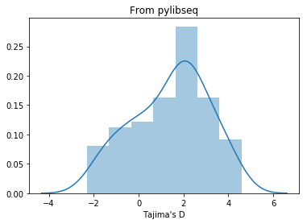

# Intro to msprime

Kevin Thornton 

UC Irvine


```python
import warnings
warnings.filterwarnings('ignore')
```

# What is msprime?

1. A re-implementation of Hudson's ms.
2. Typically 1,000x faster (often more).
3. Does not represent trees.  Rather, it represents *tree sequences* as a set of tables.
4. A Python module and a command-line program called *mspms*

# Installation

**Assuming Python 3 throughout**

## Via pip

(Use `pip3` if your system distinguishes the two!)
```sh
pip install --upgrade msprime
```

## Via conda

```sh
conda install -c conda-forge msprime
```

# Parameter scaling in the Python module

* The default $N_e$ in msprime is 1
* Means that time is in units of $N_e$ generations
* We typically parameterize simulations with $\theta = 4N_e\mu$ and $\rho = 4N_er$.
* So, be careful!

# Parameter scaling in mspms

* Identical to Hudson's `ms`, which means $4N_e$ generations.


```python
# Get some preliminaries out of the way
import msprime
import IPython # So that we can show plots
import numpy as np
```

# Example simulation

$n=10, \theta = 10, \rho = 10$


```python
theta, rho = 10., 10.
ts = msprime.simulate(10, mutation_rate = theta/4.,
                      recombination_rate = theta/4.,
                      length = 1000,
                      random_seed=42)
```

On the command-line with `mspms`:

```sh
mspms 10 -t 10 -r 10 1000
```

# `msprime.simulate` returns a "tree sequence"


```python
type(ts)
```


    msprime.trees.TreeSequence


```python
for i in range(5):
    print(ts.tables.nodes[i])
```

    NodeTableRow(flags=1, time=0.0, population=0, individual=-1, metadata=b'')
    NodeTableRow(flags=1, time=0.0, population=0, individual=-1, metadata=b'')
    NodeTableRow(flags=1, time=0.0, population=0, individual=-1, metadata=b'')
    NodeTableRow(flags=1, time=0.0, population=0, individual=-1, metadata=b'')
    NodeTableRow(flags=1, time=0.0, population=0, individual=-1, metadata=b'')


```python
for i in range(5):
    print(ts.tables.edges[i])
```

    EdgeTableRow(left=380.8359602421606, right=439.21995336171705, parent=10, child=2)
    EdgeTableRow(left=380.8359602421606, right=439.21995336171705, parent=10, child=3)
    EdgeTableRow(left=42.40044114235799, right=44.780510255317324, parent=11, child=0)
    EdgeTableRow(left=42.40044114235799, right=44.780510255317324, parent=11, child=5)
    EdgeTableRow(left=0.0, right=4.651340191404182, parent=12, child=6)


# The tables *contain* the trees


```python
# get the first tree
t = next(ts.trees())
print(t.interval)
```

    (0.0, 0.005071051419961977)


```python
IPython.display.SVG(t.draw(format="SVG",width=400,
                    node_colours={4954:'red'})) # Note spelling errours :)
```


```python
# Can iterate over various things:
print([i for i in t.leaves(4954)])
```

    [9, 3, 6, 8, 1, 5]


```python
# Can do *algorithms* on the trees
n=0
while n != msprime.NULL_NODE:
    print(n, t.time(n), [i for i in t.leaves(n)])
    n = t.parent(n)
```

    0 0.0 [0]
    2600 0.43231202079125264 [0, 2, 4]
    7175 1.5648540482383804 [0, 2, 4, 9, 3, 6, 8, 1, 5]
    12320 4.883034220232983 [7, 0, 2, 4, 9, 3, 6, 8, 1, 5]


# Advanced topic: tree traversal


```python
ts = msprime.simulate(4,random_seed=666)
t=next(ts.trees())
IPython.display.SVG(t.draw(format="SVG"))
```


```python
print([i for i in t.nodes()])
print([t.parent(i) for i in t.nodes()])
print([t.left_child(i) for i in t.nodes()]) 
print([t.right_child(i) for i in t.nodes()])
print([t.left_sib(i) for i in t.nodes()]) 
print([t.right_sib(i) for i in t.nodes()])
```

    [6, 2, 5, 1, 4, 0, 3]
    [-1, 6, 6, 5, 5, 4, 4]
    [2, -1, 1, -1, 0, -1, -1]
    [5, -1, 4, -1, 3, -1, -1]
    [-1, -1, 2, -1, 1, -1, 0]
    [-1, 5, -1, 4, -1, 3, -1]


# Simulating many replicates

The general form is:

```py
msprime.simulate(10, num_replicates=100)
```

The result is an *iterator* over the replicate simulations.


```python
for ts in msprime.simulate(10, recombination_rate = 5., num_replicates=3):
    print(ts.num_trees)
```

    33
    49
    48


```python
# Example modified from msprime tutorial

def segregating_sites_example(n, theta, num_replicates):
    S = np.zeros(num_replicates)
    replicates = msprime.simulate(
        sample_size=n,
        mutation_rate=theta/4.0,
        num_replicates=num_replicates,
        random_seed=346246)
    for j, tree_sequence in enumerate(replicates):
        S[j] = tree_sequence.num_sites
    # Now, calculate the analytical predictions
    S_mean_a = np.sum(1 / np.arange(1, n)) * theta
    S_var_a = (
        theta * np.sum(1 / np.arange(1, n)) +
        theta**2 * np.sum(1 / np.arange(1, n)**2))
    print("              mean              variance")
    print("Observed      {}\t\t{}".format(np.mean(S), np.var(S)))
    print("Analytical    {:.5f}\t\t{:.5f}".format(S_mean_a, S_var_a))
    
segregating_sites_example(100, 100, 1000)
```

                  mean              variance
    Observed      520.365		17041.581775
    Analytical    517.73775		16866.57675


# Advanced topic

* It is also possible to simulate many replicates in parallel.  
* Doing so requires Python 3's `concurrent.futures` module, or the older `multiprocessing` module.
* When doing this, use *processes* rather than *threads* to avoid contention for the [GiL](https://en.wikipedia.org/wiki/Gilean_McVean).

# Demography
A simple bottleneck:


```python
bneck = [msprime.PopulationParametersChange(time=0.01,initial_size=0.01), #EXTREME bneck
        msprime.PopulationParametersChange(time=0.02,initial_size=1.0)]
```


```python
ts = msprime.simulate(10,demographic_events=bneck, random_seed = 666)
nt=ts.tables.nodes
nl={i:"{:0.4f}".format(nt.time[i]) for i in range(len(nt))}
```


```python
IPython.display.SVG(next(ts.trees()).draw(format="svg",node_labels=nl,height=400,width=600))
```


# Demography

* Be sure to read the docs here carefully.
* The Python module behaves differently from msprime/ms
* The differences are **not** in the tutorial


```python
help(msprime.PopulationParametersChange)
```

    Help on class PopulationParametersChange in module msprime.simulations:
    
    class PopulationParametersChange(DemographicEvent)
     |  Changes the demographic parameters of a population at a given time.
     |  
     |  This event generalises the ``-eg``, ``-eG``, ``-en`` and ``-eN``
     |  options from ``ms``. Note that unlike ``ms`` we do not automatically
     |  set growth rates to zero when the population size is changed.
     |  
     |  :param float time: The time at which this event occurs in generations.
     |  :param float initial_size: The absolute size of the population
     |      at the beginning of the time slice starting at ``time``. If None,
     |      this is calculated according to the initial population size and
     |      growth rate over the preceding time slice.
     |  :param float growth_rate: The new per-generation growth rate. If None,
     |      the growth rate is not changed. Defaults to None.
     |  :param int populationd: The ID of the population affected. If
     |      ``population`` is None, the changes affect all populations
     |      simultaneously.
     |  
     |  Method resolution order:
     |      PopulationParametersChange
     |      DemographicEvent
     |      builtins.object
     |  
     |  Methods defined here:
     |  
     |  __init__(self, time, initial_size=None, growth_rate=None, population=None, population_id=None)
     |      Initialize self.  See help(type(self)) for accurate signature.
     |  
     |  __str__(self)
     |      Return str(self).
     |  
     |  get_ll_representation(self, num_populations)
     |  
     |  ----------------------------------------------------------------------
     |  Methods inherited from DemographicEvent:
     |  
     |  __repr__(self)
     |      Return repr(self).
     |  
     |  ----------------------------------------------------------------------
     |  Data descriptors inherited from DemographicEvent:
     |  
     |  __dict__
     |      dictionary for instance variables (if defined)
     |  
     |  __weakref__
     |      list of weak references to the object (if defined)
    


# Population structure


```python
config =[msprime.PopulationConfiguration(sample_size=10),
        msprime.PopulationConfiguration(sample_size=10)]
migmat=[[0,0.1],[0.1,0]]
ts = msprime.simulate(Ne=1,population_configurations=config,
                      migration_matrix=migmat, random_seed=1234567)
colors=["black","red"]
nc={i:colors[ts.tables.nodes.population[i]] for i in range(len(ts.tables.nodes))}
nl={i:'' for i in range(len(ts.tables.nodes))}
IPython.display.SVG(next(ts.trees()).draw(format="SVG",node_colours=nc,node_labels=nl))
```


# Analyzing genotype data from simulations

You have three complementery tools at your disposal

* msprime itself
* [pylibseq](https://github.com/molpopgen/pylibseq), which is a Python bridge to [libsequence](http://molpopgen.github.io/libsequence/)
* [scikit-allel](https://scikit-allel.readthedocs.io/en/latest/), which is a Python package

# Pairwise diversity

## Using msprime


```python
pi_msprime = []
for ts in msprime.simulate(10, mutation_rate=25.,
                           demographic_events=bneck,random_seed=42,
                          num_replicates=100):
    pi_msprime.append(ts.pairwise_diversity())
```

## Using pylibseq


```python
import libsequence.variant_matrix as vm
import libsequence.summstats as sstats
pi_libseq, D_libseq = [], []
for ts in msprime.simulate(100, mutation_rate=25.,
                           demographic_events=bneck,random_seed=42,
                           num_replicates=100):
    m = vm.VariantMatrix.from_TreeSequence(ts)
    ac = m.count_alleles()
    pi_libseq.append(sstats.thetapi(ac))
    D_libseq.append(sstats.tajd(ac))
```

# Plotting the output


```python
import matplotlib.pyplot as plt
import seaborn as sns
%matplotlib inline
f, ax = plt.subplots(1,2,sharey=True)
sns.distplot(pi_msprime,ax=ax[0], norm_hist=True)
sns.distplot(pi_libseq,ax=ax[1], norm_hist=True)
ax[0].set_ylabel("Density")
ax[0].axvline(x=np.array(pi_msprime).mean())
ax[1].axvline(x=np.array(pi_libseq).mean())
for i,j in zip(ax,["msprime","pylibseq"]): i.set_xlabel(r'$\pi$');i.set_title(j)
```


```python
ax = sns.distplot(D_libseq)
ax.set_xlabel("Tajima's D")
ax.set_title("From pylibseq");
```





# Using scikit-allel


```python
import allel
pi_allel=[]
D_allel=[]
for ts in msprime.simulate(100, mutation_rate=25.,
                           demographic_events=bneck,random_seed=42,
                           num_replicates=100):
    ha = allel.HaplotypeArray(ts.genotype_matrix())
    ac = ha.count_alleles()
    pi_allel.append(allel.stats.mean_pairwise_difference(ac).sum())
    D_allel.append(allel.stats.tajima_d(ac))
```


```python
f, ax = plt.subplots(2,2)
sns.distplot(pi_libseq,ax=ax[0,0])
sns.distplot(pi_allel,ax=ax[0,1])
sns.distplot(D_libseq,ax=ax[1,0])
sns.distplot(D_allel,ax=ax[1,1]);
```


# Comments

* These tools can largely all be used together.
* When applicable, msprime is probably the fastest
* pylibseq requires an extra copy.  Not sure we can "fix" that.
* allel can do PCA stuff, etc., and read various "genomics" formats.
* After the copy, pylibseq typically outperforms allel.

# Custom analysis

You may analyze the data in a tree sequence:

* one variant at a time
* one haplotype at a time
* using the entire matrix


```python
ts = msprime.simulate(5, mutation_rate=1, random_seed=405)

for v in ts.variants():
    print(v)
```

    {'site': {'id': 0, 'position': 0.6308487660717219, 'ancestral_state': '0', 'mutations': [{'id': 0, 'site': 0, 'node': 1, 'derived_state': '1', 'parent': -1, 'metadata': b''}], 'metadata': b''}, 'alleles': ('0', '1'), 'genotypes': array([0, 1, 0, 0, 0], dtype=uint8), 'position': 0.6308487660717219, 'index': 0}
    {'site': {'id': 1, 'position': 0.9504287242889404, 'ancestral_state': '0', 'mutations': [{'id': 1, 'site': 1, 'node': 7, 'derived_state': '1', 'parent': -1, 'metadata': b''}], 'metadata': b''}, 'alleles': ('0', '1'), 'genotypes': array([0, 1, 1, 1, 1], dtype=uint8), 'position': 0.9504287242889404, 'index': 1}
    {'site': {'id': 2, 'position': 0.9659729825798422, 'ancestral_state': '0', 'mutations': [{'id': 2, 'site': 2, 'node': 0, 'derived_state': '1', 'parent': -1, 'metadata': b''}], 'metadata': b''}, 'alleles': ('0', '1'), 'genotypes': array([1, 0, 0, 0, 0], dtype=uint8), 'position': 0.9659729825798422, 'index': 2}


```python
for v in ts.variants():
    print(v.genotypes,type(v.genotypes))
```

    [0 1 0 0 0] <class 'numpy.ndarray'>
    [0 1 1 1 1] <class 'numpy.ndarray'>
    [1 0 0 0 0] <class 'numpy.ndarray'>


```python
for h in ts.haplotypes():
    # Not sure why they are strings?
    print(h, type(h))
```

    001 <class 'str'>
    110 <class 'str'>
    010 <class 'str'>
    010 <class 'str'>
    010 <class 'str'>


```python
# Warning: this can use a lot of RAM
m = ts.genotype_matrix()
print(m)
print(type(m))
print(m.dtype)
print(m.shape)
```

    [[0 1 0 0 0]
     [0 1 1 1 1]
     [1 0 0 0 0]]
    <class 'numpy.ndarray'>
    uint8
    (3, 5)

